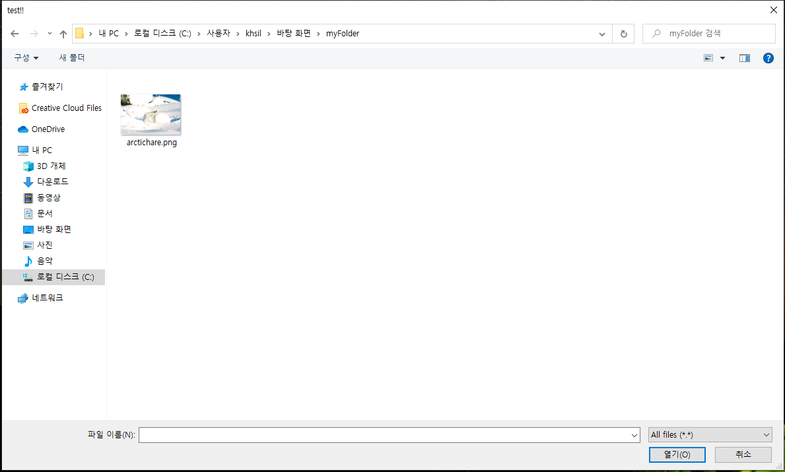

# Window File Dialog

A simple nodejs project to open file dialog. (windows only / linux,mac not supported)
Powered by PowerShell.



## Example
#### openFile
```javascript
const dialog = new FileDialog();
dialog.openFile({ title: 'test' }).then((res) => {
  console.log(res);
});
```
#### saveFile
```javascript
const dialog = new FileDialog();
dialog.saveFile({ title: 'test' }).then((res) => {
  console.log(res);
});
```
#### selectFolder
```javascript
const dialog = new FileDialog();
dialog.selectFolder({ description: 'test' }).then((res) => {
  console.log(res);
});
```